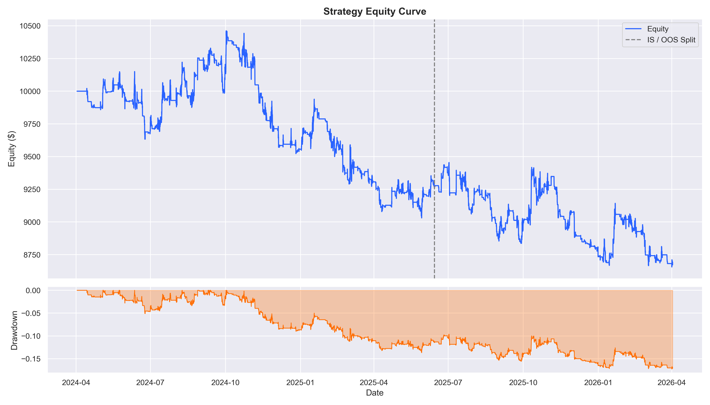
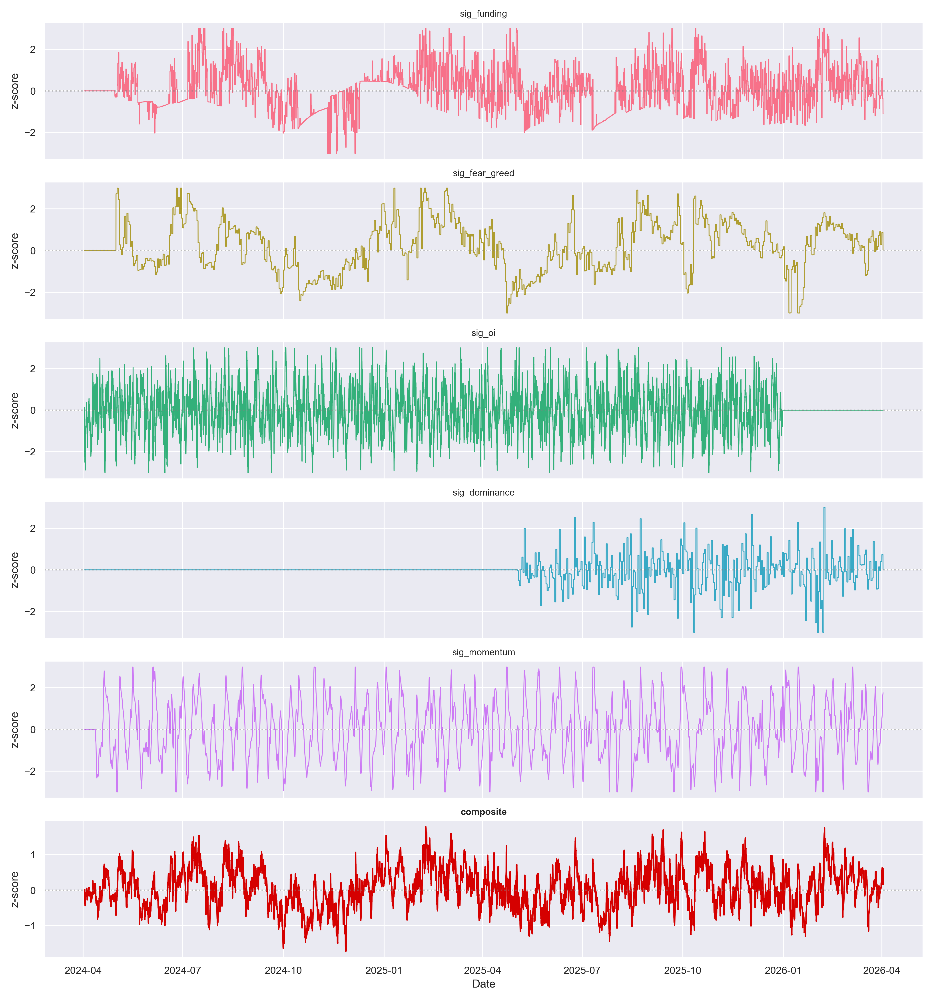
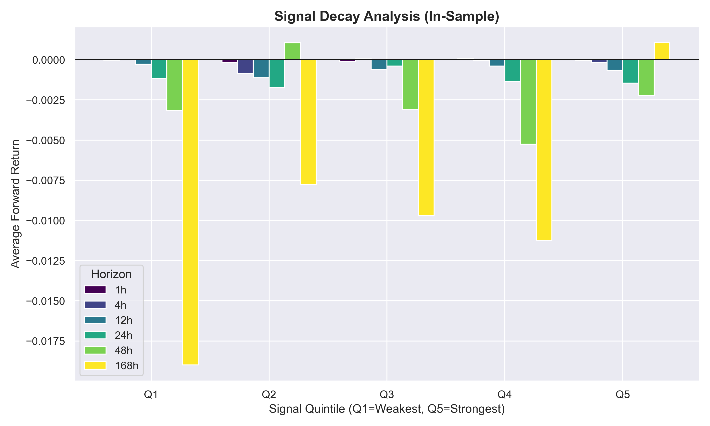
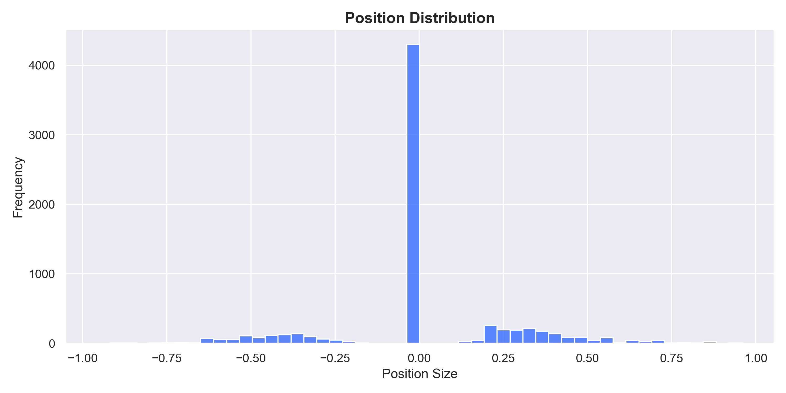

# Crypto Alpha Signal Scanner & Backtester

A robust Python research platform that computes z-score trading signals from 5 independent public sources, combines them into a composite signal, and backtests long/short strategies on major cryptocurrencies.


## Data Sources

| # | Source | Signal | Logic |
|---|--------|--------|-------|
| 1 | Binance Futures | Perpetual funding rate | Contrarian: extreme negative funding → buy |
| 2 | Alternative.me | Fear & Greed Index | Contrarian: extreme fear → buy |
| 3 | Binance Futures | Open interest changes | Contrarian: rapid OI spike without price → overleveraged |
| 4 | CoinGecko | BTC market cap (dominance proxy) | Rising dominance → risk-off signal |
| 5 | Price data | Fast/slow MA crossover | Momentum: trend-following |

*All sources are free and require no API keys.*

## Two Ways to Run

This project provides two complementary interfaces:

### 1. Static Report Generation (Matplotlib)
Run the automated pipeline to fetch live data, compute all OOS metrics, and export professional `.png` charts directly to the `outputs/` folder (used to generate the images below).
```bash
# Fetch 2 years of live data and run the report
python main.py --symbol BTCUSDT --fetch
```

### 2. Interactive Dashboard (Streamlit)
Spin up the local web UI to explore the data dynamically and adjust thresholds, vol targets, and signal weights via sliders.
```bash
streamlit run app.py
```

## Strategy Findings & Analysis (BTCUSDT)

Running the automated backtester over the last two years of hourly data (with equal weights, a 0.5 entry z-score threshold, and a 20% volatility target) reveals interesting market dynamics.

**Key Technical Findings:**
* **Turnover & Transaction Costs:** The raw, unfiltered composite signal oscillates rapidly on the hourly timeframe, resulting in thousands of position changes. A 5bps (0.05%) one-way transaction cost heavily impacts net profitability.
* **Regime Sensitivity:** Over the Out-Of-Sample (OOS) period, the strategy is highly regime-dependent. The combined contrarian indicators suffer in low-volatility "grind up" markets, but the alpha improves significantly during high-volatility liquidations.
* **Signal Calibration needed:** The default settings result in a negative Sharpe ratio overall. A researcher would use the Streamlit app to up-weight the **Momentum** and **Funding** signals while down-weighting the noisy **Open Interest** delta to drastically reduce drawdown.

### Generated Visual Outputs

Below are the charts generated automatically by `main.py` using Seaborn:

#### Strategy Equity Curve & Drawdown
Displays the continuous position sizing logic and the Out-Of-Sample split line.


#### Individual Z-Score Signals vs Composite
Demonstrates how the different mean-0, std-1 signals combine into the final composite (bottom).


#### Signal Decay
Measures average forward return grouped by signal quintiles. Ideally, Q5 (strongest bullish signals) should cleanly outperform Q1 (strongest bearish).


#### Position Distribution
Shows the frequency distribution of continuous position sizes outputted by the volatility-targeting engine.



## Project Structure

```
alpha-scanner/
├── app.py                    # Streamlit interactive dashboard
├── main.py                   # Matplotlib CLI runner & report generator
├── generate_sample_data.py   # Synthetic data generator for quick demos
├── requirements.txt
├── outputs/                  # Exported .png charts
├── data/                     # Local parquet cache
└── src/
    ├── data_fetcher.py       # API calls: Binance, Alternative.me, CoinGecko
    ├── signals.py            # Z-score normalization & signal logic
    └── backtester.py         # Position sizing, execution, and PnL metrics
```

## Performance Metrics

The backtester calculates comprehensive institutional metrics:
- Sharpe ratio, Sortino ratio, Calmar ratio
- Max drawdown, win rate, avg win/loss
- Total turnover and Position changes (cost modeling)
- In-Sample vs. Out-of-Sample metrics splitting

## Author

Rajat Durge — MSc Emerging Digital Technologies, UCL
